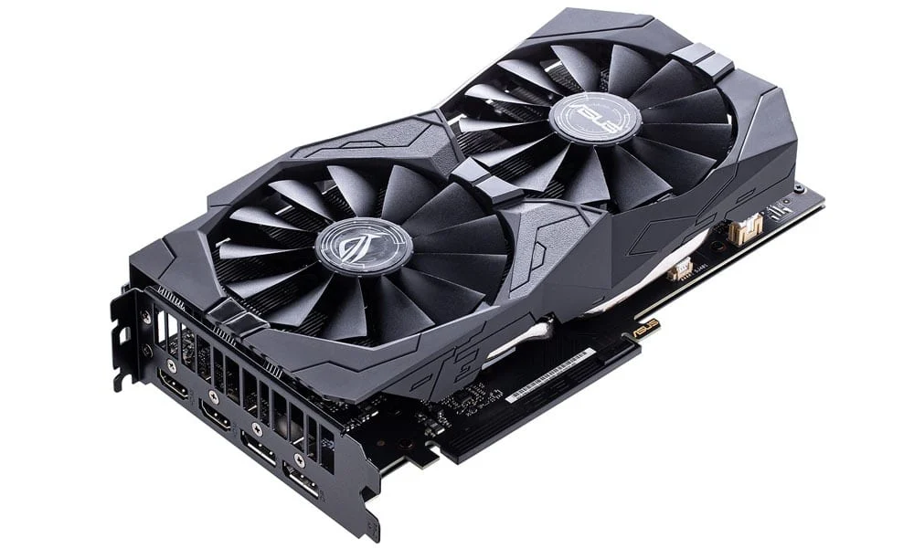

# Computers

Believe it or not, computers are hundreds of years old. They began as simple counting machines and basic calculators, such as Charles Thomas' arithmometer, or Charles Babbage's difference engine. Modern computers are much more advanced, able to perform these calculations in fractions of a second. This chapter covers the parts of a modern computer and what role they serve in programming.

Each chapter will contain a list of key concepts. I consider these to be the absolute minimum knowledge barrier required to move to the next chapter. Key concepts are bolded when they are defined. You can click on each concept to jump to where they are defined at.

| Key concepts in this chapter
| -
| [CPU](#k-cpu)
| [RAM](#k-ram)
| [Storage](#k-storage)
| [Motherboard](#k-mobo)
| [GPU](#k-gpu)

## CPU

The **central processing unit (CPU)** is what performs logical calculations. The CPU takes very basic instructions, called machine code, and operates them lightning-fast. It's hard for humans to write this code by hand, so we use programming languages to help. They act as a bridge between human language and machine code.

 

This is a CPU. You often don't see them while the computer is running, though, because they get very hot while running. A cooling fan or pump covers the processor.

## RAM

**Random access memory (RAM)** contains all of the data the CPU will operate on, including program data. As a computer user, the RAM is exists as sticks of memory shown below. They vary in capacity, but most sticks are 8 or 16 GB.

 

Although not necessary to understand, there also exists smaller stores of RAM inside of the CPU. These stores are much faster than a memory stick, but are much smaller due to high costs. The CPU operates on values contained in the smallest of these stores, called registers.

## Storage

There is a flaw with RAM, however. When the computer turns off, all of the data is erased. **Storage** is data that _persists_ when the computer is turned off. When you install a file, the file is moved onto your storage system. There's two common storage mediums in use today: Hard disk drives (HDDs), and solid-state drives (SSDs).

### Hard disk drives

HDDs are large storage mediums that consist of a spinning disk, and an "arm" that reads off of the disk. The entire drive is sealed, as any moisture or dust will stop the drive from working properly. The image below shows what a HDD looks like when the seal is broken.

 

### Solid state drives

SSDs store data inside of a chip, not too dissimilar to RAM. The difference is that SSDs retain their data when powered off, and are slower. The picture below shows two different types of SSDs, with the main difference being that the one on the left is generally faster than the one on the right.

 

## Motherboard

The **motherboard** is what connects all of the components of a computer together. Primarily, it allows connection between the CPU, RAM, and storage, however just as important is input and output (I/O). There are _many_ types of input and output, such as USB devices, PCIE, and SATA. USB is the modern connection for practically anything, especially input devices such as keyboards and mice. PCIE is for devices that require rapid connection, such as the graphics rendering and some SSDs. SATA is another connection used for storage, such as HDDs.

 

## GPU

The **graphics processing unit (GPU)** is a special type of processor that is used to display video. It plugs into the long, horizontal slots called PCIE. GPUs excel at performing short tasks at the same time, which is the main difference between them and CPUs. GPUs are slower when they have to perform lots of branching operations, which will be touched on in a later chapter.

 